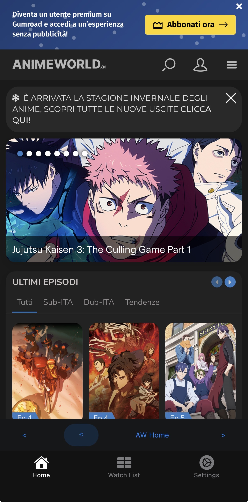
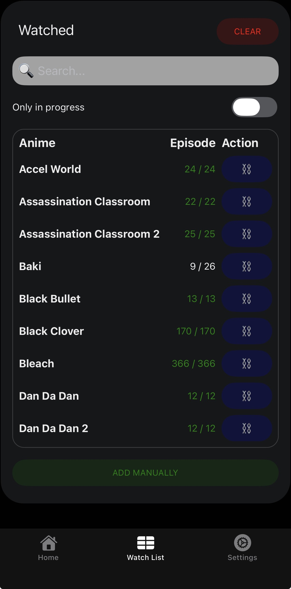
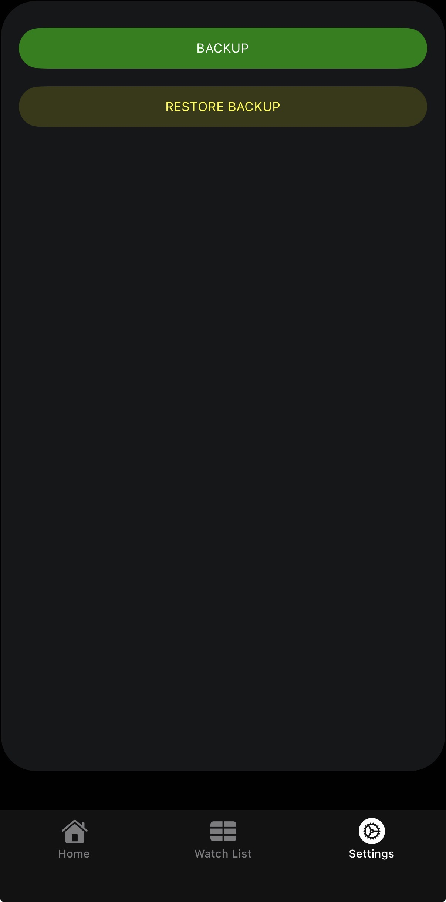

# Anime Tracker (Unofficial AnimeWorld client) 💫

> Lightweight, privacy-minded mobile app that embeds AnimeWorld and keeps a local watch history.

---

## 📌 TL;DR

- Wraps https://www.animeworld.ac inside a WebView and automatically detects when you open an anime episode.
- Stores watch progress locally (AsyncStorage) and exposes a simple **Watch List** UI to view / edit items.
- Export and import your data as a JSON backup from the **Settings** screen.
- Built with Expo — runs on iOS add Android (behavior may vary by platform, web is not supported by the webview library).

---

## ✨ Features

- Embedded WebView with injected JavaScript that detects anime title and episode and posts messages to the app ✅
- Auto-tracking of the last watched episode per anime (updates only when a higher episode number is detected) ✅
- Manual add/edit via the **Add/Edit Anime** modal ✅
- Watch List with filtering (in-progress / watched), remove items, and clear watched ✅
- Backup (export) and Restore (import) via device sharing / document picker (exports `anime-tracker/backup.json`) ✅
- All data stored locally — no servers, no accounts 🔒

---

## How it works (quick)

1. The main WebView (see `app/(tabs)/index.tsx`) injects JS into AnimeWorld pages and posts messages to React Native when it detects an anime/episode.
2. Messages are parsed and persisted in the AppStore (`utils/app-store.util.ts`) which uses `AsyncStorage` under the hood (`utils/storage.util.ts`).
3. The Watch List screen (`app/(tabs)/watch-list.tsx`) reads the stored state and shows the current progress for each anime.
4. Backup and restore flows are implemented via `expo-file-system`, `expo-sharing` and `expo-document-picker`.

---

## 📱 Screenshots





---

## Getting started (development) 🔧

Requirements: Node.js and npm, plus Xcode/Android Studio if using simulators/emulators.

1. Install

```bash
npm install
```

2. Start

```bash
npm start
# or use platform scripts
npm run ios
npm run android
npm run web
```

Notes:

- Expo powers this project — see `package.json` for scripts.
- The app uses file-based routing (see the `app` folder) via `expo-router`.

---

## Developer notes

- Main WebView code and injected JS: `app/(tabs)/index.tsx` 🔍
- Watch list UI & actions: `app/(tabs)/watch-list.tsx` ✅
- Add/Edit modal: `app/anime-modal.tsx`
- Backup / Restore: `utils/app-store.util.ts` (creates `anime-tracker/backup.json` and uses system sharing/document picker)
- Type definitions: `model/*.ts`

---

## Legal / Disclaimer ⚠️

This is an **unofficial** client and is not affiliated with AnimeWorld. It only embeds the AnimeWorld site and stores local navigation history. Please respect the website's terms of use and copyright.

---

## License

See `LICENSE` in this repository.
