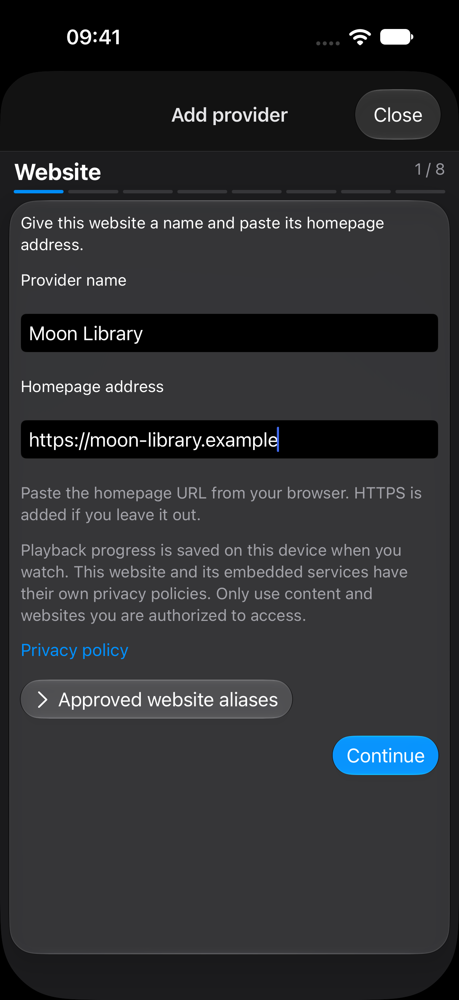
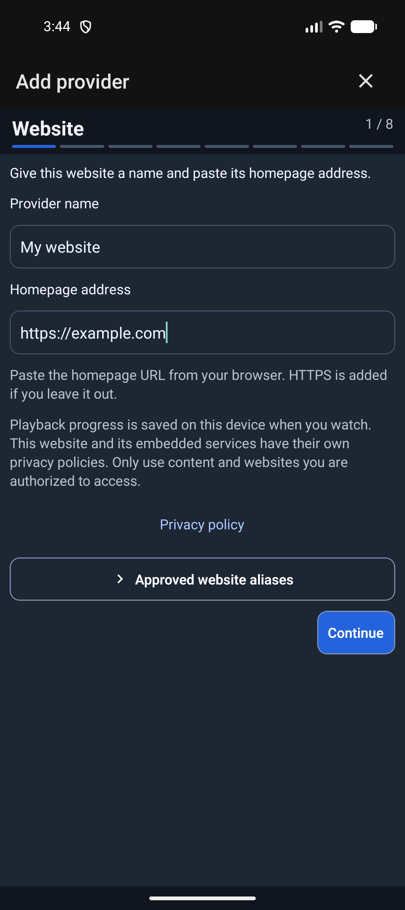
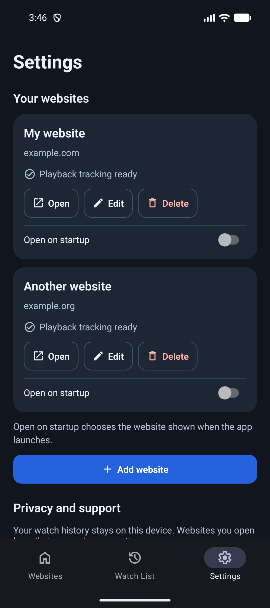

<div align="center">
  
  <h1>Anime Tracker</h1>
  <p><strong>Your websites. Your episodes. Your progress.</strong></p>
  <p>Bring your own anime website and keep your watch history in one place.</p>
  <p>
    
    
    
    <a href="LICENSE"></a>
  </p>
  <p>
    <a href="#features">Features</a> ·
    <a href="#screenshots">Screenshots</a> ·
    <a href="#setup">Website setup</a> ·
    <a href="#development">Development</a>
  </p>
</div>

---

Anime Tracker is an Expo / React Native app for iOS and Android. You configure the websites you use, browse them inside the app, and track episodes as you watch. Your website configurations and watch history are stored locally on your device, with no Anime Tracker account or backend required.

The app starts with **no built-in websites or providers**. A provider is a configuration you create that tells the app where to find series information and which video player to track. Compatibility depends on the website and its player.

<a id="features"></a>

## ✨ Features

|     | Feature                        | What you get                                                                                                                                             |
| :-: | ------------------------------ | -------------------------------------------------------------------------------------------------------------------------------------------------------- |
| 🌐  | **Your own websites**          | Select titles, episode numbers, and announced totals directly on a website. The guided creator checks two example series pages.                          |
| ▶️  | **Playback tracking & resume** | Save per-episode progress and resume supported players. Embedded and cross-origin players work where the device and player expose the required controls. |
| 🟩  | **Progress where you watch**   | Green fills on episode links show saved playback percentages, including across paginated lists.                                                          |
| 📚  | **One shared watch list**      | Matching series titles share progress. Browse recently played, search, filter, sort alphabetically, or add and edit manually.                            |
| 🎯  | **The right episode, ready**   | Reopen the recorded website and main episode URL. Deleting a website preserves watch history.                                                            |
| 💾  | **Portable history & backups** | Share a lightweight watch-list export or transfer website configurations and detailed history with Backup / Restore.                                     |

Ongoing series, partially released seasons, paginated episode lists, and unknown announced totals are supported. The announced total is independent of the number of episodes currently listed; an unknown total does not automatically mark a series finished.

<a id="screenshots"></a>

## 📱 Screenshots

### iOS

The website screenshot was captured on an iPhone 18 Pro simulator running iOS 27.0. The other iOS screenshots were captured on an iPhone 17 Pro simulator running iOS 26.5. Website names and addresses have been anonymized in the images; they represent user-created configurations, not built-in providers. The website page is an original facsimile with fictional content and illustrative episode progress.

<p align="center">
  
  
  
</p>

<p align="center">
  
  
  
</p>

### Android

Captured on the running QEMU Android 17 emulator. Website names and addresses use anonymous example values. The website page is an original facsimile with fictional content and illustrative episode progress. Development controls were hidden before capture.

<p align="center">
  
  
  
</p>

<p align="center">
  
  
  
</p>

<p align="center">
  
</p>

<a id="setup"></a>

## 🧭 Set up a website

1. Choose **Add provider** from the website chooser or Settings. Enter a name and homepage address.
2. Open two different series pages and choose **Use this page** for each.
3. Select the series title, an episode number, and the announced total on the website. Unknown-total markers such as `??`, `TBA`, `N/A`, and `Unknown` are accepted; actual episode numbers must be numeric.
4. Open an episode, activate its player if needed, and press Play. If several players appear, choose the primary player. Advancing playback verifies progress tracking and enables Continue.
5. Optionally check automatic resume under **Video options**. This briefly seeks one second and restores the position; it is not required to continue when progress tracking is verified.
6. Review the automatic checks for both example pages, fix or retest any failed selections, then save the provider.

The creator keeps the website visible above a compact panel. Expand Selection tools for a manual CSS selector, surrounding-element selection, or Undo. Existing providers can be edited from Settings.

<a id="playback"></a>

## ▶️ Playback & browsing

A detected video alone does not prove that tracking works. Some players appear only after you activate a placeholder or press Play. If progress cannot be verified, the creator offers help and requires explicit acknowledgment of the limitations before continuing without verified tracking. Automatic resume is optional and may remain unavailable even when progress tracking works.

Recently played dates update only when playback advances. Paused visits, episode selection, seeking, and manual edits do not move a series to the top of the list.

Navigating the main page to an unapproved website asks before adding its exact origin to the current provider's approved addresses. Approval must succeed before the original destination opens. Pop-ups stay blocked; embedded players do not need a website alias solely because they use another origin.

Website configurations and history are local to the app. Browsing still connects to the websites and player services you choose. Anime Tracker is not affiliated with those websites and does not host their videos.

<a id="backup"></a>

## 💾 Export & backup

Settings provides two separate exports:

| Action                | Contents                                                                                            | Purpose                                                                  |
| --------------------- | --------------------------------------------------------------------------------------------------- | ------------------------------------------------------------------------ |
| **Export watch list** | `watch-list.json`, containing only `name`, `highestWatchedEpisode`, `totalEpisodes`, and `finished` | Share a portable summary of every series, regardless of current filters. |
| **Backup / Restore**  | Full app data, including providers, playback dates, and per-episode progress                        | Transfer or restore the app's configuration and history.                 |

In the lightweight export, unknown totals are `null`. `highestWatchedEpisode` is the highest episode reached, not a count of distinct episodes watched. This export omits website URLs and detailed playback data; use a full backup to restore the app.

---

<a id="development"></a>

## 🛠️ Development

Requirements: Node.js and npm, plus Xcode for iOS or Android Studio and the Android SDK for Android.

```bash
npm ci
npm run ios      # Build and launch the iOS development app
npm run android  # Build and launch the Android development app
npm start        # Start Metro for an installed development app
```

Use native development builds to test website browsing and playback. The WebView-based browser is not supported on web; `npm run web` is not a playback validation target.

Dependency installation runs [scripts/patch-webview.cjs](scripts/patch-webview.cjs), which patches Android all-frame injection for `react-native-webview@13.16.1`. Rebuild the Android development app after installing the patch; Expo Go or a JavaScript reload cannot apply it. Cross-origin frame tracking requires Android System WebView support for `DOCUMENT_START_SCRIPT`. Devices without that feature retain accessible-player tracking and report the limitation for inaccessible players. Review the patch before upgrading WebView.

### 🗂️ Code map

| Area                                              | Files                                                                                                                                                                                                                                                            |
| ------------------------------------------------- | ---------------------------------------------------------------------------------------------------------------------------------------------------------------------------------------------------------------------------------------------------------------- |
| Main website browser                              | [app/(tabs)/index.tsx](<app/(tabs)/index.tsx>)                                                                                                                                                                                                                   |
| Provider creator route and step UI                | [app/provider-creator.tsx](app/provider-creator.tsx), [components/provider-creator/](components/provider-creator/)                                                                                                                                               |
| Wizard, browser messages, Review, and persistence | [hooks/provider-creator/](hooks/provider-creator/)                                                                                                                                                                                                               |
| Grouped creator state and transitions             | [utils/provider-creator-state.ts](utils/provider-creator-state.ts)                                                                                                                                                                                               |
| Website extraction and playback runtime           | [assets/js/provider-runtime_t.cjs](assets/js/provider-runtime_t.cjs), [model/provider-runtime.model.ts](model/provider-runtime.model.ts), [utils/provider-runtime.ts](utils/provider-runtime.ts), [utils/provider-page-checks.ts](utils/provider-page-checks.ts) |
| Watch List                                        | [app/(tabs)/watch-list/](<app/(tabs)/watch-list/>), [components/watch-list/](components/watch-list/)                                                                                                                                                             |
| Manual series editing                             | [app/anime-modal.tsx](app/anime-modal.tsx)                                                                                                                                                                                                                       |
| Local storage, export, and backup                 | [utils/app-store.util.ts](utils/app-store.util.ts), [utils/backup.util.ts](utils/backup.util.ts), [utils/watch-list.ts](utils/watch-list.ts)                                                                                                                     |

Injected scripts retain the `_t.cjs` suffix because the custom Metro transformer imports them as source strings. After changing runtime logic, reload the website: reinjection updates configuration without replacing the installed script logic.

### ✅ Validation

```bash
npm test
npm run typecheck
npm run lint
```

Tests run production modules and the injected runtime with Node's test runner and JSDOM. Follow the [device acceptance checklist](docs/provider-testing.md) for real playback, embedded players, resume, navigation approvals, backups, and native UI behavior. Simulated media cannot verify native playback, keyboard handling, scrolling, or iOS Liquid Glass appearance.

<a id="privacy"></a>

## 🔒 Privacy & App Store submission

The app includes an offline privacy policy in Settings and website setup. Publication-ready copies are in [English](docs/privacy-policy.md) and [Italian](docs/privacy-policy.it.md). See [App Store submission guidance](docs/app-store-submission.md) for policy publication, content authorization, review notes, age ratings, and native privacy-manifest validation.

<a id="license"></a>

## 📄 License

See [LICENSE](LICENSE).
