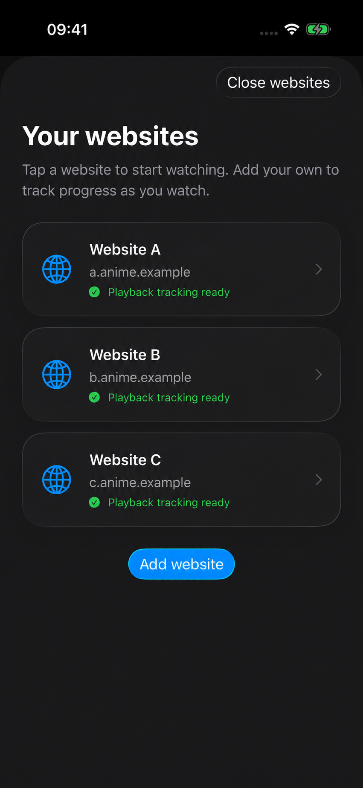
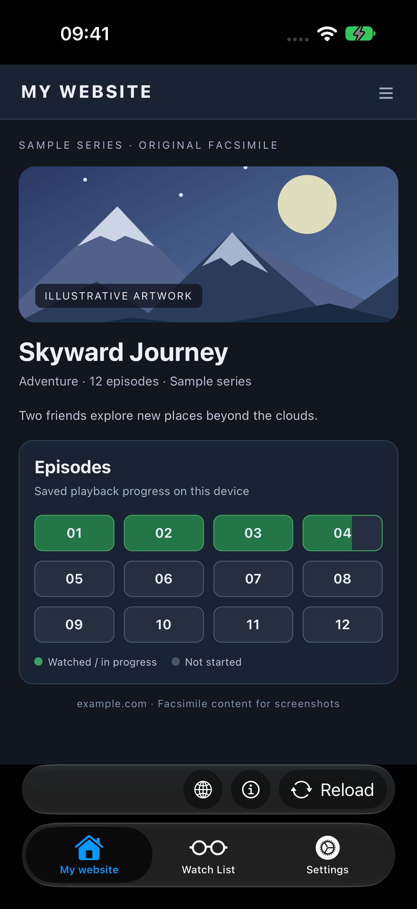
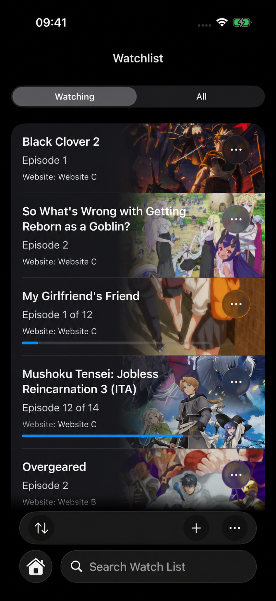
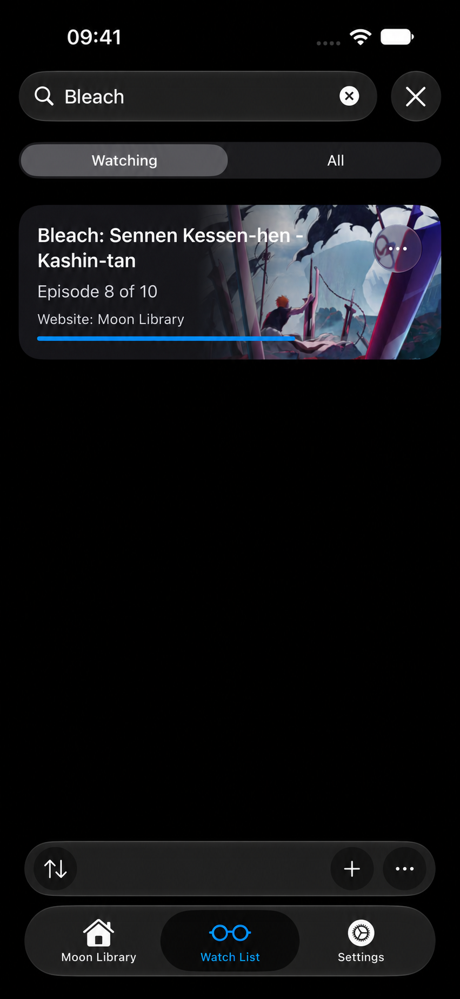
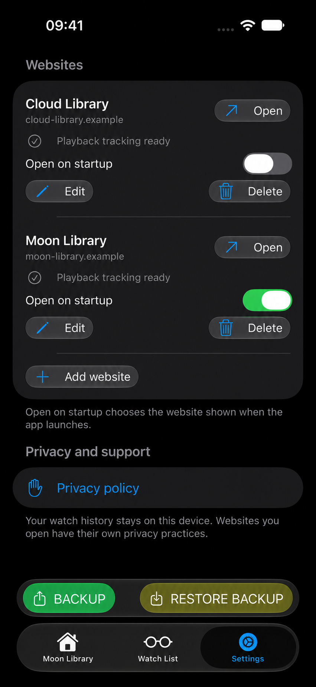
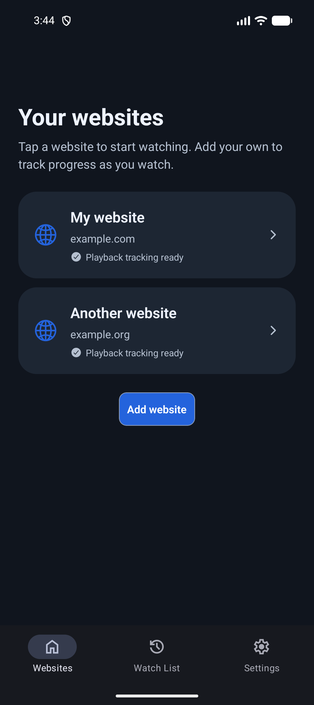
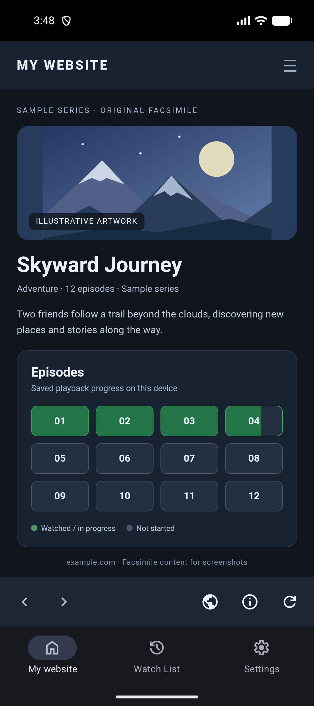
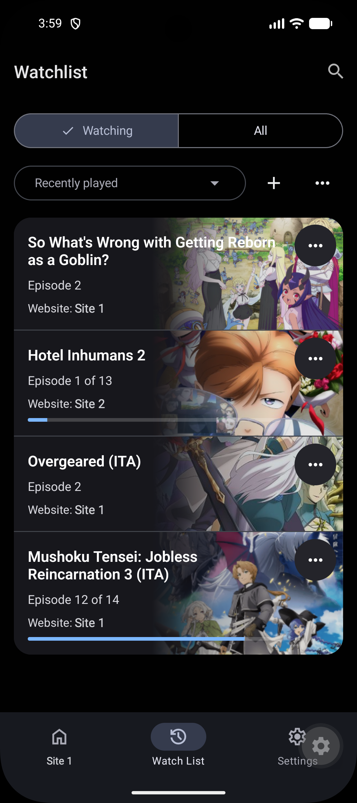
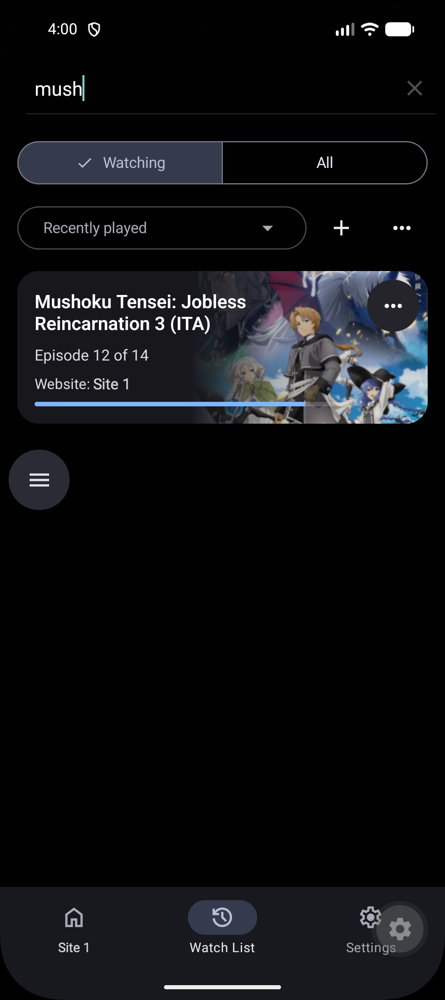
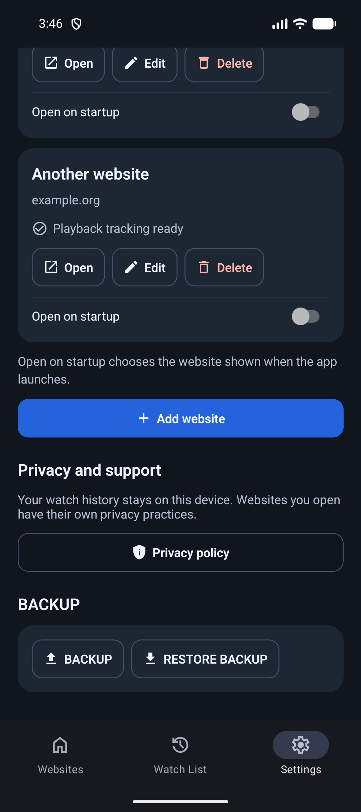

# Anime Tracker 💫

> A mobile app for user-configured anime websites, with local watch history and video progress.

---

## 📌 TL;DR

- Start with no built-in providers. Add a website through the guided provider creator, then browse and track it.
- Opening an unapproved website asks before adding its exact origin to the provider's approved addresses and continuing. Pop-ups remain blocked.
- Stores watch progress locally (AsyncStorage) and exposes a simple **Watch List** UI to view / edit items.
- Export and import your data as a JSON backup from the **Settings** screen.
- Built with Expo — runs on iOS add Android (behavior may vary by platform, web is not supported by the webview library).

---

## ✨ Features

- Embedded WebView with injected JavaScript that detects anime title and episode and posts messages to the app ✅
- Auto-tracking of the last watched episode per anime (updates only when a higher episode number is detected) ✅
- Manual add/edit via the **Add/Edit Anime** modal ✅
- Watch List with filtering (in-progress / watched), Recently played / A–Z / Z–A sorting, remove items, and clear watched ✅
- Playback dates update when the selected video advances; Watch List opens the saved episode URL with its recorded provider ✅
- Export watch list from Settings as a small `watch-list.json` with names, highest episode reached, total episodes, and completion status ✅
- Backup (export) and Restore (import) via device sharing / document picker (exports `anime-tracker/backup.json`) ✅
- All data stored locally — no servers, no accounts 🔒

---

## How it works (quick)

1. Add a website from Websites or Settings. Select titles and episode information, verify two example pages, and play the site's primary video to verify progress tracking. The automatic resume check is optional under Video options.
2. The creator and main browser share `assets/js/provider-runtime_t.cjs` for extraction, video progress, and resume. Each embedded frame inspects its own HTML5 video and relays media samples to the main page, including players hosted on another origin. Series and episode information comes from the main page.
3. Typed messages are validated and persisted in the AppStore (`utils/app-store.util.ts`), using `AsyncStorage`.
4. Watch History stores the provider used for each playback location. Provider setup warns when progress or seeking cannot be verified.
5. Backup and restore use `expo-file-system`, `expo-sharing` and `expo-document-picker`.

The separate **Export watch list** action shares a JSON array of `{ name, highestWatchedEpisode, totalEpisodes, finished }`. Unknown totals use `null`. The episode number is the highest episode reached, matching Watch List; it is not a count of distinct episodes watched. The export includes all history and omits providers, URLs, dates, and per-episode details. Use the full **Backup** action for restoring the app's data.

---

## 📱 Screenshots

### IOS 🍎

<div style="display: flex;">  
  
  
  
  
  
</div>

### Android 🤖

<div style="display: flex;">  
  
  
  
  
  
</div>

---

## Getting started (development) 🔧

Requirements: Node.js and npm, plus Xcode/Android Studio if using simulators/emulators.

1. Install

```bash
npm install
```

2. Start

```bash
npm start
# or use platform scripts
npm run ios
npm run android
npm run web
```

Notes:

- Expo powers this project — see `package.json` for scripts.
- `npm install` / `npm ci` applies the version-checked Android WebView patch in `scripts/patch-webview.cjs`. Rebuild with `npm run android` after installing it; a JavaScript update or Expo Go cannot enable Android frame injection. Android System WebView must support AndroidX's `DOCUMENT_START_SCRIPT` feature. Devices without it retain page and accessible-frame tracking and report the embedded-player limitation.
- The app uses file-based routing (see the `app` folder) via `expo-router`.

---

## Developer notes

- Main WebView code and injected JS: `app/(tabs)/index.tsx` 🔍
- Watch list UI & actions: `app/(tabs)/watch-list.tsx` ✅
- Add/Edit modal: `app/anime-modal.tsx`
- Backup / Restore: `utils/app-store.util.ts` (creates `anime-tracker/backup.json` and uses system sharing/document picker)
- Type definitions: `model/*.ts`
- Validation: `npm test`, `npm run typecheck`, and `npm run lint`. See [device acceptance checks](docs/provider-testing.md).

---

## Legal / Disclaimer ⚠️

The app embeds websites configured by the user and stores watch history locally. It is not affiliated with those websites.

---

## License

See `LICENSE` in this repository.
